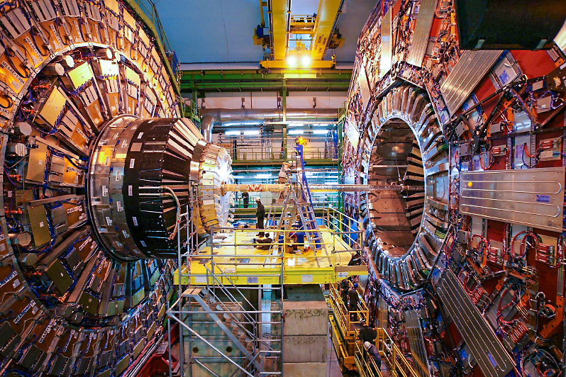

# Welcome to the UC San Diego User Analysis Facility (UAF) Documentation

Welcome to the High Energy Physics User Analysis Facility at UC San Diego. We provide advanced computational resources and expert support for high energy physics research. Our facility is equipped to assist with data analysis from major experiments like the Large Hadron Collider.